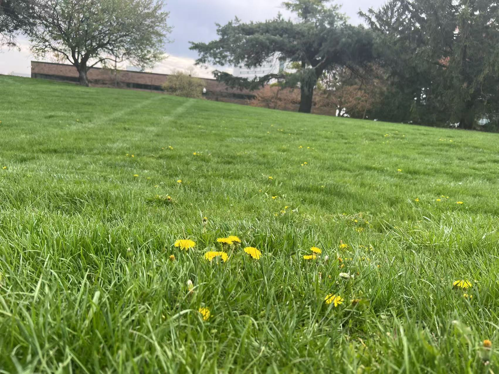

#### Apirl 17th 2025

If I ever have a yard, I would cover it with grass and scatter dandelion seeds, so that in spring, the tiny yellow dandelion flowers would fill the lawn with delightful surprises.

Also, I don't like yards with shrubs. I hope to plant a few trees that have beautiful blossoms, although I haven't decided which kind yet. I also want to grow a small bamboo grove, so that my cats and dogs can go there and nibble on the bamboo.